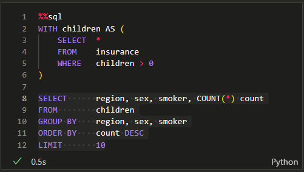

### Summary

1. 115 Female are smokers while 159 Male are smokers
2. Southeast has the highest number of non smokers, 273. Northwest and Southwest has 58 smokers, the lowest across all region.
3. Northwest and Southwest are the region with average charge lower than the overall average charge.
4. Southeast has the highest number of smokers
5. The average charges from Female is $12,570